# Shop App – E-Commerce with Supabase & Flutter

A **complete e-commerce application** built using **Flutter**, **Supabase**, and **REST APIs**, featuring a modern, clean, and responsive design.  
Users can browse products, add them to their cart or favorites, place and track their orders — all with smooth animations and performance optimizations.

---

## Features

### Authentication

- Email & Password (Register / Login / Reset Password).
- **Email Verification** before login.
- **Google** & **Apple Sign-In** integration.
- Full user session management with **Supabase Auth**.

### Shopping Features

- **Dynamic Product Listing** using RESTful APIs via **Dio**.
- **Pagination** for efficient product loading.
- **Handel Error** The app handles API and authentication errors gracefully using try–catch and BLoC states showing clear messages to the user.
- **Skeleton Loading** using `skeletonizer` for smooth UX.
- **Add / Remove / Update Quantity** in cart.
- **Favorite Products** stored locally.
- **Hive** used for local caching of cart & favorites.

### Orders & Tracking

- Create and store orders securely in **Supabase Database**.
- Add user details when placing an order.
- Real-time **Order Status Tracking**:  
  `Pending → Processing → Delivered`.
- **Order Details Screen** showing all relevant information.

### Multi-language & Theming

- Supports **Arabic 🇪🇬** and **English 🇬🇧** using `easy_localization`.
- **Dark / Light Mode** toggle.
- Fully **responsive UI** for all screen sizes.

---

## Tech Stack

| Category                 | Technology         |
| ------------------------ | ------------------ |
| **Frontend**             | Flutter & Dart     |
| **Backend / Auth**       | Supabase           |
| **Networking**           | Dio (REST APIs)    |
| **State Management**     | BLoC / Provider    |
| **Local Storage**        | Hive               |
| **Dependency Injection** | GetIt              |
| **Localization**         | Easy Localization  |
| **Persistence**          | Shared Preferences |
| **UI Enhancements**      | Skeletonizer       |

---

## Screenshots

  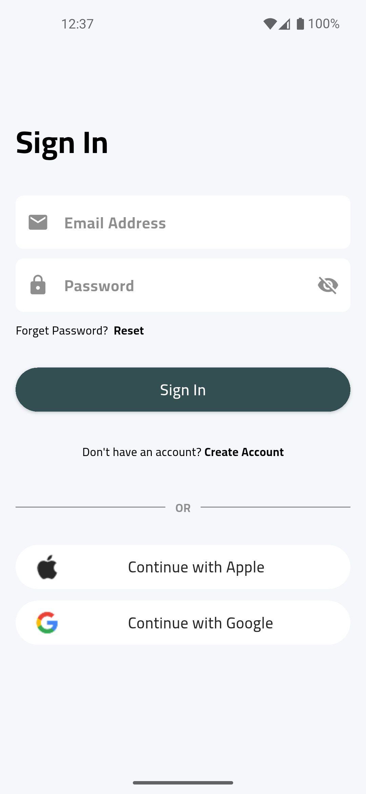
  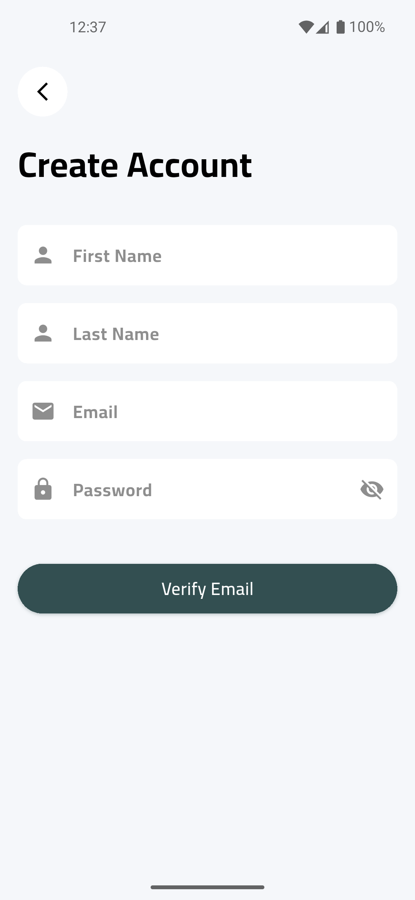
  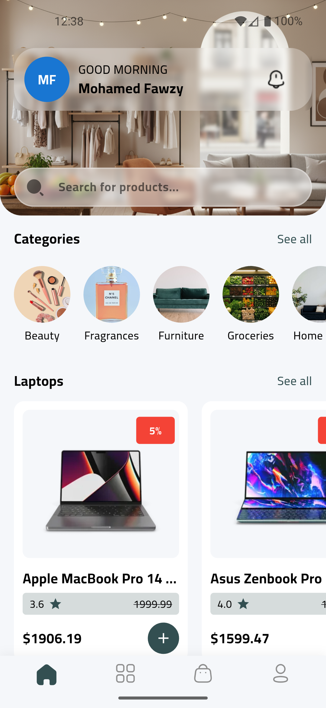
  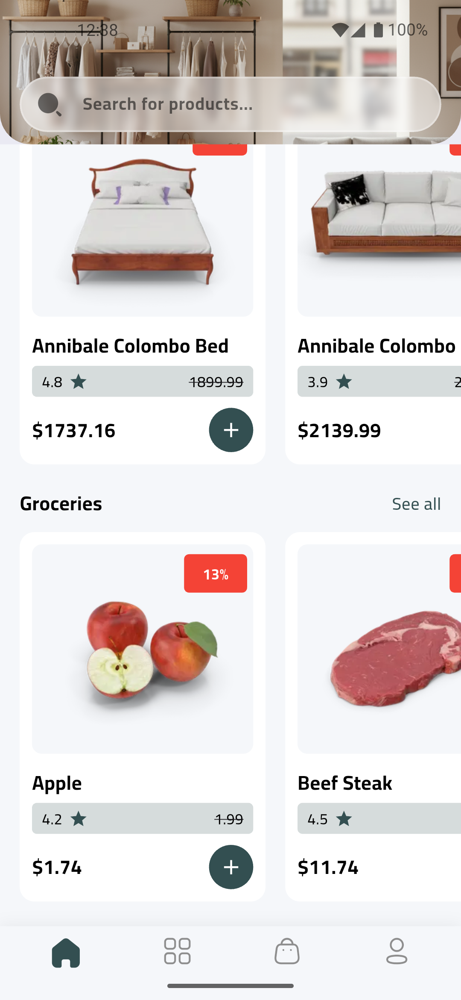
  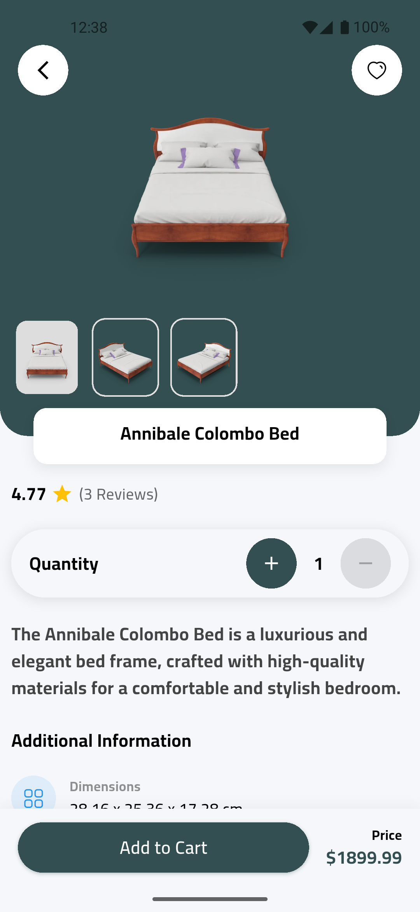
  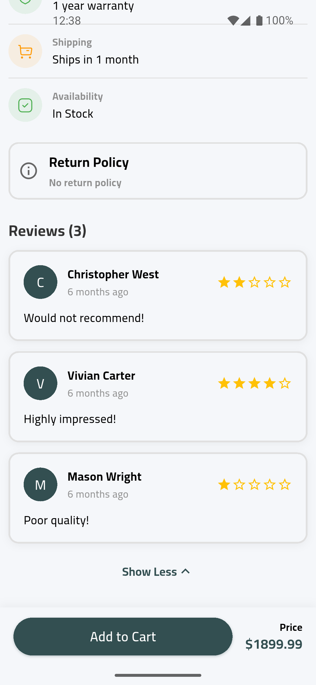
  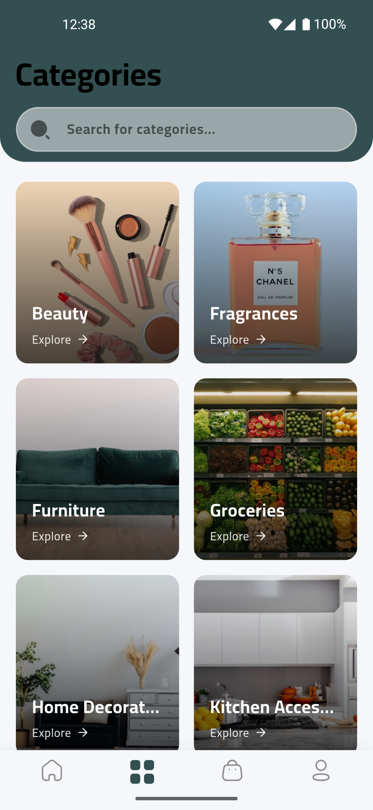
  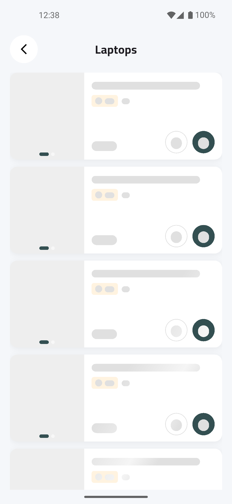
  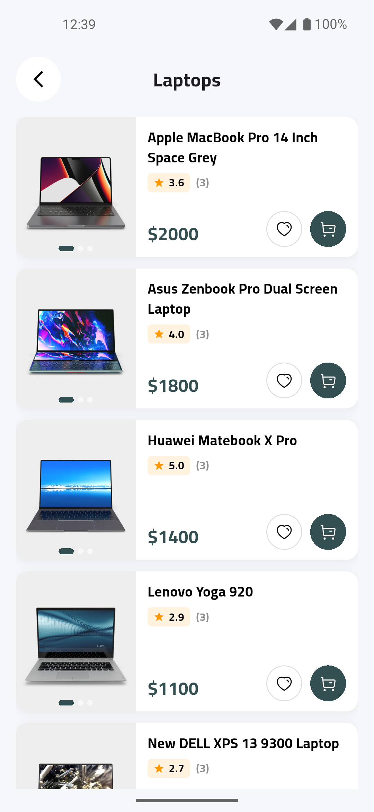
  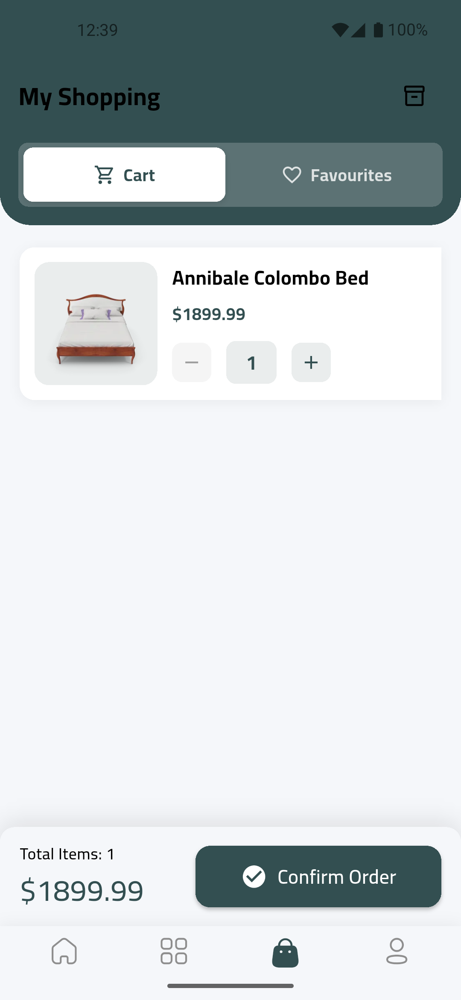
  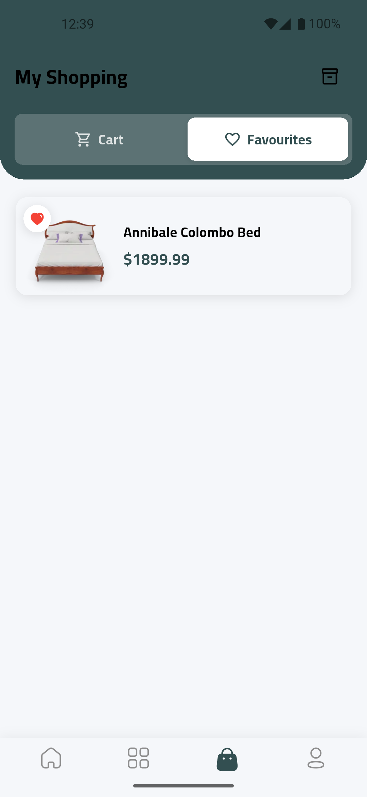
  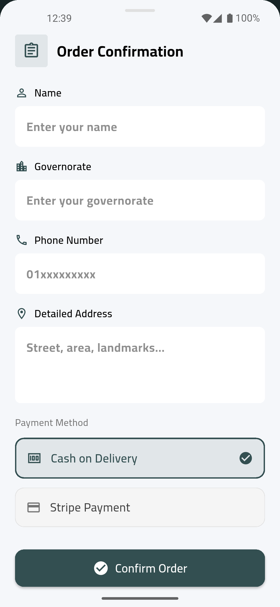
  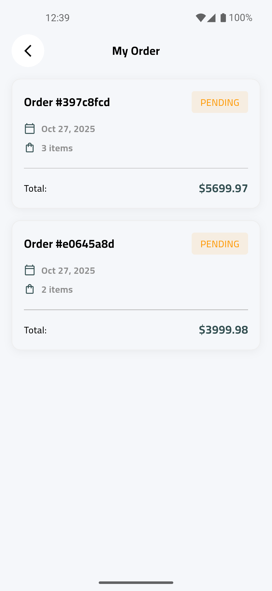
  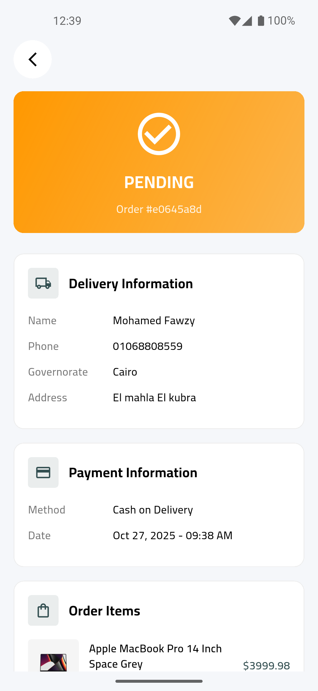
  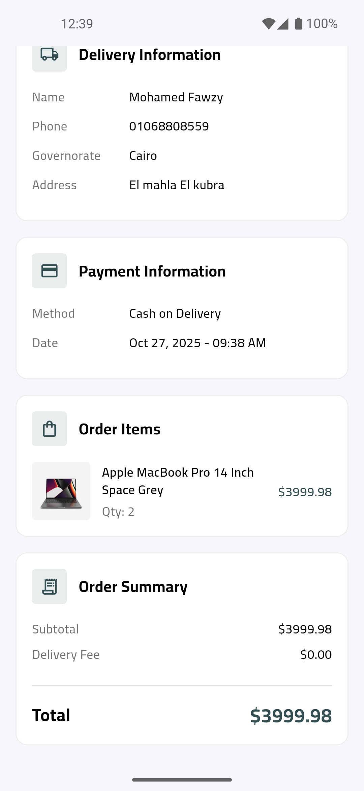

